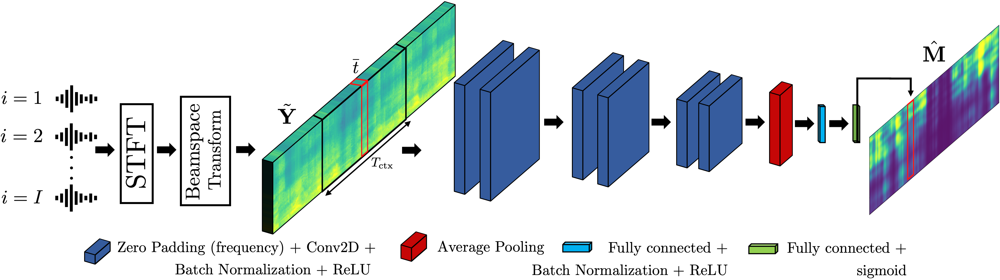

The problems of speech separation and enhancement concern the extraction of the speech emitted by a target speaker when placed in a scenario where multiple interfering speakers or noise are present, respectively. A plethora of practical applications such as home assistants and teleconferencing require some sort of speech separation and enhancement preprocessing before applying Automatic Speech Recognition (ASR) systems. In the recent years, most techniques have focused on the application of deep learning to either time-frequency or time-domain representations of the input audio signals. In this paper we propose a real-time multichannel speech separation and enhancement technique, which is based on the combination of a directional representation of the soundfield, denoted as beamspace, with a lightweight Convolutional Neural Network (CNN). We consider the case where the Direction-of-Arrival (DOA) of the target speaker is approximately known, a scenario where the power of the beamspace-based representation can be fully exploited, while we make no assumption regarding the identity of the talker. We present experiments where the model is trained on simulated data and tested on real recordings and we compare the proposed method with a similar state-of-the-art technique.

### Method

# Listening tests
Here below we report some audio examples along with the spectrogram of the signals.  

For each example the setup, the mixture at the first microhone and the desired target are depicted.  
We compare the results of the proposed method with the NBDF approach and the mixture beamformer steered to 90°.

For each setup we report the comparison between the three array configuration used in the validation. Hence, I=4 with d=26mm,
and I=3, I=4 with d=52mm.

<!-- ***************************************** EXAMPLE 1 *************************************************** -->
<table style="width: 100%; table-layout: fixed; word-wrap: normal;">
  <!-- SETUP -->
  <tr> 
    <th colspan="4" style="text-align:center;">EXAMPLE 1</th>
  </tr>
  <tr>
    <td>
      Setup
    </td>
    <td>
      
    </td>
    <td>
      
      <audio controls>
        <source src="examples/exs1/ds1/mixture_mic0.wav" type="audio/mpeg">
        Your browser does not support the audio element.
      </audio>
    </td>
    <td>
      
      <audio controls>
        <source src="examples/exs1/ds1/target_beamspace.wav" type="audio/mpeg">
        Your browser does not support the audio element.
      </audio>
    </td>
  </tr>
  <!-- TITLE 
  <tr> 
    <td>
      Dataset
    </td>
    <td>
      Mixture Beamspace
    </td>
    <td>
      NBDF method
    </td>
    <td>
      Proposed method
    </td>
  </tr>
  -->
  <!-- DATASET 1 -->
  <tr> 
    <td>
      I = 4  
      d = 26mm
    </td>
    <td>
      
      <audio controls>
        <source src="examples/exs1/ds1/mixture_beamspace.wav" type="audio/mpeg">
        Your browser does not support the audio element.
      </audio>
    </td>
    <td>
      
      <audio controls>
        <source src="examples/exs1/ds1/nbdf.wav" type="audio/mpeg">
        Your browser does not support the audio element.
      </audio>
    </td>
    <td>
      
      <audio controls>
        <source src="examples/exs1/ds1/proposed.wav" type="audio/mpeg">
        Your browser does not support the audio element.
      </audio>
    </td>
  </tr>
  <!-- DATASET 2 -->
  <tr> 
    <td>
      I = 3  
      d = 52mm
    </td>
    <td>
      
      <audio controls>
        <source src="examples/exs1/ds2/mixture_beamspace.wav" type="audio/mpeg">
        Your browser does not support the audio element.
      </audio>
    </td>
    <td>
      
      <audio controls>
        <source src="examples/exs1/ds2/nbdf.wav" type="audio/mpeg">
        Your browser does not support the audio element.
      </audio>
    </td>
    <td>
      
      <audio controls>
        <source src="examples/exs1/ds2/proposed.wav" type="audio/mpeg">
        Your browser does not support the audio element.
      </audio>
    </td>
  </tr>
  <!-- DATASET 3 -->
  <tr> 
    <td>
      I = 4  
      d = 52mm
    </td>
    <td>
      
      <audio controls>
        <source src="examples/exs1/ds3/mixture_beamspace.wav" type="audio/mpeg">
        Your browser does not support the audio element.
      </audio>
    </td>
    <td>
      
      <audio controls>
        <source src="examples/exs1/ds3/nbdf.wav" type="audio/mpeg">
        Your browser does not support the audio element.
      </audio>
    </td>
    <td>
      
      <audio controls>
        <source src="examples/exs1/ds3/proposed.wav" type="audio/mpeg">
        Your browser does not support the audio element.
      </audio>
    </td>
  </tr>
</table>

<!-- ***************************************** EXAMPLE 2 *************************************************** -->

<table style="width: 100%; table-layout: fixed; word-wrap: normal;">
  <!-- SETUP -->
  <tr> 
    <th colspan="4" style="text-align:center;">EXAMPLE 2</th>
  </tr>
  <tr>
    <td>
      Setup
    </td>
    <td>
      
    </td>
    <td>
      
      <audio controls>
        <source src="examples/exs2/ds1/mixture_mic0.wav" type="audio/mpeg">
        Your browser does not support the audio element.
      </audio>
    </td>
    <td>
      
      <audio controls>
        <source src="examples/exs2/ds1/target_beamspace.wav" type="audio/mpeg">
        Your browser does not support the audio element.
      </audio>
    </td>
  </tr>
  <!-- TITLE 
  <tr> 
    <td>
      Dataset
    </td>
    <td>
      Mixture Beamspace
    </td>
    <td>
      NBDF method
    </td>
    <td>
      Proposed method
    </td>
  </tr>
  -->
  <!-- DATASET 1 -->
  <tr> 
    <td>
      I = 4  
      d = 26mm
    </td>
    <td>
      
      <audio controls>
        <source src="examples/exs2/ds1/mixture_beamspace.wav" type="audio/mpeg">
        Your browser does not support the audio element.
      </audio>
    </td>
    <td>
      
      <audio controls>
        <source src="examples/exs2/ds1/nbdf.wav" type="audio/mpeg">
        Your browser does not support the audio element.
      </audio>
    </td>
    <td>
      
      <audio controls>
        <source src="examples/exs2/ds1/proposed.wav" type="audio/mpeg">
        Your browser does not support the audio element.
      </audio>
    </td>
  </tr>
  <!-- DATASET 2 -->
  <tr> 
    <td>
      I = 3  
      d = 52mm
    </td>
    <td>
      
      <audio controls>
        <source src="examples/exs2/ds2/mixture_beamspace.wav" type="audio/mpeg">
        Your browser does not support the audio element.
      </audio>
    </td>
    <td>
      
      <audio controls>
        <source src="examples/exs2/ds2/nbdf.wav" type="audio/mpeg">
        Your browser does not support the audio element.
      </audio>
    </td>
    <td>
      
      <audio controls>
        <source src="examples/exs2/ds2/proposed.wav" type="audio/mpeg">
        Your browser does not support the audio element.
      </audio>
    </td>
  </tr>
  <!-- DATASET 3 -->
  <tr> 
    <td>
      I = 4  
      d = 52mm
    </td>
    <td>
      
      <audio controls>
        <source src="examples/exs2/ds3/mixture_beamspace.wav" type="audio/mpeg">
        Your browser does not support the audio element.
      </audio>
    </td>
    <td>
      
      <audio controls>
        <source src="examples/exs2/ds3/nbdf.wav" type="audio/mpeg">
        Your browser does not support the audio element.
      </audio>
    </td>
    <td>
      
      <audio controls>
        <source src="examples/exs2/ds3/proposed.wav" type="audio/mpeg">
        Your browser does not support the audio element.
      </audio>
    </td>
  </tr>
</table>

<!-- ***************************************** EXAMPLE 3 *************************************************** -->

<table style="width: 100%; table-layout: fixed; word-wrap: normal;">
  <!-- SETUP -->
  <tr> 
    <th colspan="4" style="text-align:center;">EXAMPLE 3</th>
  </tr>
  <tr>
    <td>
      Setup
    </td>
    <td>
      
    </td>
    <td>
      
      <audio controls>
        <source src="examples/exs3/ds1/mixture_mic0.wav" type="audio/mpeg">
        Your browser does not support the audio element.
      </audio>
    </td>
    <td>
      
      <audio controls>
        <source src="examples/exs3/ds1/target_beamspace.wav" type="audio/mpeg">
        Your browser does not support the audio element.
      </audio>
    </td>
  </tr>
  <!-- TITLE 
  <tr> 
    <td>
      Dataset
    </td>
    <td>
      Mixture Beamspace
    </td>
    <td>
      NBDF method
    </td>
    <td>
      Proposed method
    </td>
  </tr>
  -->
  <!-- DATASET 1 -->
  <tr> 
    <td>
      I = 4  
      d = 26mm
    </td>
    <td>
      
      <audio controls>
        <source src="examples/exs3/ds1/mixture_beamspace.wav" type="audio/mpeg">
        Your browser does not support the audio element.
      </audio>
    </td>
    <td>
      
      <audio controls>
        <source src="examples/exs3/ds1/nbdf.wav" type="audio/mpeg">
        Your browser does not support the audio element.
      </audio>
    </td>
    <td>
      
      <audio controls>
        <source src="examples/exs3/ds1/proposed.wav" type="audio/mpeg">
        Your browser does not support the audio element.
      </audio>
    </td>
  </tr>
  <!-- DATASET 2 -->
  <tr> 
    <td>
      I = 3  
      d = 52mm
    </td>
    <td>
      
      <audio controls>
        <source src="examples/exs3/ds2/mixture_beamspace.wav" type="audio/mpeg">
        Your browser does not support the audio element.
      </audio>
    </td>
    <td>
      
      <audio controls>
        <source src="examples/exs3/ds2/nbdf.wav" type="audio/mpeg">
        Your browser does not support the audio element.
      </audio>
    </td>
    <td>
      
      <audio controls>
        <source src="examples/exs3/ds2/proposed.wav" type="audio/mpeg">
        Your browser does not support the audio element.
      </audio>
    </td>
  </tr>
  <!-- DATASET 3 -->
  <tr> 
    <td>
      I = 4  
      d = 52mm
    </td>
    <td>
      
      <audio controls>
        <source src="examples/exs3/ds3/mixture_beamspace.wav" type="audio/mpeg">
        Your browser does not support the audio element.
      </audio>
    </td>
    <td>
      
      <audio controls>
        <source src="examples/exs3/ds3/nbdf.wav" type="audio/mpeg">
        Your browser does not support the audio element.
      </audio>
    </td>
    <td>
      
      <audio controls>
        <source src="examples/exs3/ds3/proposed.wav" type="audio/mpeg">
        Your browser does not support the audio element.
      </audio>
    </td>
  </tr>
</table>

<!-- ***************************************** EXAMPLE 4 *************************************************** -->

<table style="width: 100%; table-layout: fixed; word-wrap: normal;">
  <!-- SETUP -->
  <tr> 
    <th colspan="4" style="text-align:center;">EXAMPLE 4</th>
  </tr>
  <tr>
    <td>
      Setup
    </td>
    <td>
      
    </td>
    <td>
      
      <audio controls>
        <source src="examples/exs4/ds1/mixture_mic0.wav" type="audio/mpeg">
        Your browser does not support the audio element.
      </audio>
    </td>
    <td>
      
      <audio controls>
        <source src="examples/exs4/ds1/target_beamspace.wav" type="audio/mpeg">
        Your browser does not support the audio element.
      </audio>
    </td>
  </tr>
  <!-- TITLE 
  <tr> 
    <td>
      Dataset
    </td>
    <td>
      Mixture Beamspace
    </td>
    <td>
      NBDF method
    </td>
    <td>
      Proposed method
    </td>
  </tr>
  -->
  <!-- DATASET 1 -->
  <tr> 
    <td>
      I = 4  
      d = 26mm
    </td>
    <td>
      
      <audio controls>
        <source src="examples/exs4/ds1/mixture_beamspace.wav" type="audio/mpeg">
        Your browser does not support the audio element.
      </audio>
    </td>
    <td>
      
      <audio controls>
        <source src="examples/exs4/ds1/nbdf.wav" type="audio/mpeg">
        Your browser does not support the audio element.
      </audio>
    </td>
    <td>
      
      <audio controls>
        <source src="examples/exs4/ds1/proposed.wav" type="audio/mpeg">
        Your browser does not support the audio element.
      </audio>
    </td>
  </tr>
  <!-- DATASET 2 -->
  <tr> 
    <td>
      I = 3  
      d = 52mm
    </td>
    <td>
      
      <audio controls>
        <source src="examples/exs4/ds2/mixture_beamspace.wav" type="audio/mpeg">
        Your browser does not support the audio element.
      </audio>
    </td>
    <td>
      
      <audio controls>
        <source src="examples/exs4/ds2/nbdf.wav" type="audio/mpeg">
        Your browser does not support the audio element.
      </audio>
    </td>
    <td>
      
      <audio controls>
        <source src="examples/exs4/ds2/proposed.wav" type="audio/mpeg">
        Your browser does not support the audio element.
      </audio>
    </td>
  </tr>
  <!-- DATASET 3 -->
  <tr> 
    <td>
      I = 4  
      d = 52mm
    </td>
    <td>
      
      <audio controls>
        <source src="examples/exs4/ds3/mixture_beamspace.wav" type="audio/mpeg">
        Your browser does not support the audio element.
      </audio>
    </td>
    <td>
      
      <audio controls>
        <source src="examples/exs4/ds3/nbdf.wav" type="audio/mpeg">
        Your browser does not support the audio element.
      </audio>
    </td>
    <td>
      
      <audio controls>
        <source src="examples/exs4/ds3/proposed.wav" type="audio/mpeg">
        Your browser does not support the audio element.
      </audio>
    </td>
  </tr>
</table>

<!-- ***************************************** EXAMPLE 5 *************************************************** -->

<table style="width: 100%; table-layout: fixed; word-wrap: normal;">
  <!-- SETUP -->
  <tr> 
    <th colspan="4" style="text-align:center;">EXAMPLE 5</th>
  </tr>
  <tr>
    <td>
      Setup
    </td>
    <td>
      
    </td>
    <td>
      
      <audio controls>
        <source src="examples/exs5/ds1/mixture_mic0.wav" type="audio/mpeg">
        Your browser does not support the audio element.
      </audio>
    </td>
    <td>
      
      <audio controls>
        <source src="examples/exs5/ds1/target_beamspace.wav" type="audio/mpeg">
        Your browser does not support the audio element.
      </audio>
    </td>
  </tr>
  <!-- TITLE 
  <tr> 
    <td>
      Dataset
    </td>
    <td>
      Mixture Beamspace
    </td>
    <td>
      NBDF method
    </td>
    <td>
      Proposed method
    </td>
  </tr>
  -->
  <!-- DATASET 1 -->
  <tr> 
    <td>
      I = 4  
      d = 26mm
    </td>
    <td>
      
      <audio controls>
        <source src="examples/exs5/ds1/mixture_beamspace.wav" type="audio/mpeg">
        Your browser does not support the audio element.
      </audio>
    </td>
    <td>
      
      <audio controls>
        <source src="examples/exs5/ds1/nbdf.wav" type="audio/mpeg">
        Your browser does not support the audio element.
      </audio>
    </td>
    <td>
      
      <audio controls>
        <source src="examples/exs5/ds1/proposed.wav" type="audio/mpeg">
        Your browser does not support the audio element.
      </audio>
    </td>
  </tr>
  <!-- DATASET 2 -->
  <tr> 
    <td>
      I = 3  
      d = 52mm
    </td>
    <td>
      
      <audio controls>
        <source src="examples/exs5/ds2/mixture_beamspace.wav" type="audio/mpeg">
        Your browser does not support the audio element.
      </audio>
    </td>
    <td>
      
      <audio controls>
        <source src="examples/exs5/ds2/nbdf.wav" type="audio/mpeg">
        Your browser does not support the audio element.
      </audio>
    </td>
    <td>
      
      <audio controls>
        <source src="examples/exs5/ds2/proposed.wav" type="audio/mpeg">
        Your browser does not support the audio element.
      </audio>
    </td>
  </tr>
  <!-- DATASET 3 -->
  <tr> 
    <td>
      I = 4  
      d = 52mm
    </td>
    <td>
      
      <audio controls>
        <source src="examples/exs5/ds3/mixture_beamspace.wav" type="audio/mpeg">
        Your browser does not support the audio element.
      </audio>
    </td>
    <td>
      
      <audio controls>
        <source src="examples/exs5/ds3/nbdf.wav" type="audio/mpeg">
        Your browser does not support the audio element.
      </audio>
    </td>
    <td>
      
      <audio controls>
        <source src="examples/exs5/ds3/proposed.wav" type="audio/mpeg">
        Your browser does not support the audio element.
      </audio>
    </td>
  </tr>
</table>

<!-- ***************************************** EXAMPLE 6 *************************************************** -->

<table style="width: 100%; table-layout: fixed; word-wrap: normal;">
  <!-- SETUP -->
  <tr> 
    <th colspan="4" style="text-align:center;">EXAMPLE 6</th>
  </tr>
  <tr>
    <td>
      Setup
    </td>
    <td>
      
    </td>
    <td>
      
      <audio controls>
        <source src="examples/exs6/ds1/mixture_mic0.wav" type="audio/mpeg">
        Your browser does not support the audio element.
      </audio>
    </td>
    <td>
      
      <audio controls>
        <source src="examples/exs6/ds1/target_beamspace.wav" type="audio/mpeg">
        Your browser does not support the audio element.
      </audio>
    </td>
  </tr>
  <!-- TITLE 
  <tr> 
    <td>
      Dataset
    </td>
    <td>
      Mixture Beamspace
    </td>
    <td>
      NBDF method
    </td>
    <td>
      Proposed method
    </td>
  </tr>
  -->
  <!-- DATASET 1 -->
  <tr> 
    <td>
      I = 4  
      d = 26mm
    </td>
    <td>
      
      <audio controls>
        <source src="examples/exs6/ds1/mixture_beamspace.wav" type="audio/mpeg">
        Your browser does not support the audio element.
      </audio>
    </td>
    <td>
      
      <audio controls>
        <source src="examples/exs6/ds1/nbdf.wav" type="audio/mpeg">
        Your browser does not support the audio element.
      </audio>
    </td>
    <td>
      
      <audio controls>
        <source src="examples/exs6/ds1/proposed.wav" type="audio/mpeg">
        Your browser does not support the audio element.
      </audio>
    </td>
  </tr>
  <!-- DATASET 2 -->
  <tr> 
    <td>
      I = 3  
      d = 52mm
    </td>
    <td>
      
      <audio controls>
        <source src="examples/exs6/ds2/mixture_beamspace.wav" type="audio/mpeg">
        Your browser does not support the audio element.
      </audio>
    </td>
    <td>
      
      <audio controls>
        <source src="examples/exs6/ds2/nbdf.wav" type="audio/mpeg">
        Your browser does not support the audio element.
      </audio>
    </td>
    <td>
      
      <audio controls>
        <source src="examples/exs6/ds2/proposed.wav" type="audio/mpeg">
        Your browser does not support the audio element.
      </audio>
    </td>
  </tr>
  <!-- DATASET 3 -->
  <tr> 
    <td>
      I = 4  
      d = 52mm
    </td>
    <td>
      
      <audio controls>
        <source src="examples/exs6/ds3/mixture_beamspace.wav" type="audio/mpeg">
        Your browser does not support the audio element.
      </audio>
    </td>
    <td>
      
      <audio controls>
        <source src="examples/exs6/ds3/nbdf.wav" type="audio/mpeg">
        Your browser does not support the audio element.
      </audio>
    </td>
    <td>
      
      <audio controls>
        <source src="examples/exs6/ds3/proposed.wav" type="audio/mpeg">
        Your browser does not support the audio element.
      </audio>
    </td>
  </tr>
</table>

